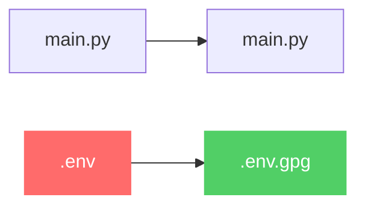

<p align="center">
  
</p>

# gitcloakd

**GPG encryption for Git repositories. Hide secrets, code, or everything.**

[](https://www.python.org/downloads/)
[](https://pypi.org/project/gitcloakd/)
[](https://opensource.org/licenses/MIT)
[](https://gnupg.org/)

---

## Try It Now

| Resource | Description |
|----------|-------------|
| [](https://drive.google.com/file/d/1MFmQCljP1cs57bwpMDW14MxEfOUzGTgC/view?usp=drive_link) | Clone and decrypt an encrypted repo |
| [](https://drive.google.com/file/d/1f2hGf3aZbrgN7_nqeAbtMthtjs_rlAWi/view?usp=sharing) | All modes, commands, and Python API |
| [](https://drive.google.com/file/d/1MmbopbuhXvHo6gW0D0c_uyZCwrFywCzr/view?usp=drive_link) | User management and common issues |
| [](https://github.com/haKC-ai/07bf37a1-ce68-4bd1-8e71-7767f7b0d07a) | See what unauthorized users see |

---

## What It Does

gitcloakd encrypts your Git repositories using GPG. Three modes for different needs:

| Mode | What's Encrypted | Git History | Repo Name | Use Case |
|------|------------------|-------------|-----------|----------|
| **Selective** | Specific files only | Visible | Visible | Open source with private secrets |
| **Full** | Entire codebase | Visible | Visible | Private codebase, team access only |
| **Dark** | Everything | Hidden | UUID | Maximum privacy, zero metadata |

### Authorized vs Unauthorized View

```
# What authorized users see:
my-secret-project/
  src/api/payments.py
  src/core/algorithm.py
  .env
  README.md

# What everyone else sees (Dark Mode):
07bf37a1-ce68-4bd1-8e71-7767f7b0d07a/
  encrypted.gpg
  README.md ("This repository is encrypted")
```

---

## Install

```bash
pip install gitcloakd
```

Requirements: Python 3.9+, GPG 2.x, Git 2.x

---

## Quick Start

```bash
# Selective: encrypt specific files (.env, keys, etc.)
gitcloakd init --wizard
gitcloakd encrypt

# Full: encrypt entire codebase
gitcloakd init --full
gitcloakd encrypt --full

# Dark: encrypt everything including history and repo name
gitcloakd init --dark
gitcloakd encrypt --dark
```

### Test Before You Commit

```bash
gitcloakd test create --mode dark    # Create demo repo
gitcloakd test dry-run --mode full   # Preview changes (no modifications)
gitcloakd test backup                # Backup before encrypting
```

---

## Encryption Modes

### Selective Mode

Encrypts only files matching patterns (`.env`, `*.key`, `*.pem`, etc.). Source code stays readable. Normal git workflow.

```bash
gitcloakd init --wizard
gitcloakd encrypt
```



### Full Mode

Packs entire codebase into single encrypted blob. Git history preserved. Unauthorized users see only `encrypted.gpg`.

```bash
gitcloakd init --full
gitcloakd encrypt --full
```

### Dark Mode

Maximum privacy. Encrypts code, git history, commit messages, and replaces repo name with random UUID. Zero metadata leakage.

```bash
gitcloakd init --dark
gitcloakd encrypt --dark
```

What's hidden in Dark Mode:

| Item | Selective | Full | Dark |
|------|-----------|------|------|
| Source code | Visible | Hidden | Hidden |
| File structure | Visible | Hidden | Hidden |
| Git history | Visible | Visible | Hidden |
| Commit messages | Visible | Visible | Hidden |
| Branch names | Visible | Visible | Hidden |
| Contributors | Visible | Visible | Hidden |
| Project name | Visible | Visible | Hidden (UUID) |

**Dark Mode Limitation:** Single encrypted blob means no merge capability. Whoever pushes last wins. Best for solo projects, archives, or single-writer repos.

---

## Local Workstation Protection

Encrypt gitcloakd's local data so a stolen laptop reveals nothing:

```bash
gitcloakd secure init    # Set up encrypted storage
gitcloakd unlock         # Decrypt to work
gitcloakd lock           # Re-encrypt when done
```

| Data | Without secure init | With secure init |
|------|---------------------|------------------|
| Repo list | Plaintext | Encrypted |
| Command history | Plaintext | Encrypted |
| Cached tokens | Plaintext | Encrypted |

---

## User Management

### Add Collaborators

```bash
# Import their GPG key
gpg --import colleague.pub

# Add to repository
gitcloakd add-user --email colleague@example.com --key-id THEIR_KEY_ID

# Re-encrypt to include new user
gitcloakd encrypt --dark
git add -A && git commit -m "Add collaborator" && git push
```

### Dark Mode Name Control

Control whether users see the real project name or only the UUID:

```bash
# User sees real name
gitcloakd dark add-user -e user@example.com -k KEY_ID --reveal-name

# User sees only UUID
gitcloakd dark add-user -e user@example.com -k KEY_ID --hide-name
```

### Remove Access

```bash
gitcloakd remove-user colleague@example.com
gitcloakd encrypt --dark
git add -A && git commit -m "Revoke access" && git push
```

---

## Python API

```python
from gitcloakd import encrypt_files, decrypt_files, encrypt_matching

# Encrypt specific files
encrypt_files([".env", "config/secrets.yaml"])

# Encrypt all files matching patterns
encrypt_matching(["*.env", "*.key", "**/*.pem"])

# Decrypt
decrypt_files([".env.gpg"])
```

### Pre-Commit Hook

```python
#!/usr/bin/env python3
from gitcloakd import encrypt_staged
import subprocess, sys

result = encrypt_staged()
if result['encrypted']:
    for f in result['encrypted']:
        subprocess.run(["git", "add", f + ".gpg"])
if result['errors']:
    sys.exit(1)
```

---

## Commands Reference

| Command | Description |
|---------|-------------|
| `init` | Initialize encryption (`--wizard`, `--full`, `--dark`) |
| `encrypt` | Encrypt files (`--all`, `--full`, `--dark`) |
| `decrypt` | Decrypt files (`--all`, `--full`, `--dark`) |
| `status` | Show encryption status |
| `check` | Run security audit |
| `add-user` | Add collaborator |
| `remove-user` | Revoke access |
| `secure init` | Set up local protection |
| `lock` / `unlock` | Lock/unlock local storage |
| `test create` | Create demo repo |
| `test dry-run` | Preview changes |
| `test backup` | Backup before encryption |
| `clean paranoid` | Secure cleanup |

---

## Security Model

### What gitcloakd protects:

- Source code (Full/Dark modes)
- Sensitive files (all modes)
- Git history and commits (Dark mode)
- Project name (Dark mode)
- Local workstation data (with `secure init`)

### What gitcloakd does NOT protect:

- Repository existence on GitHub (repo visible, contents encrypted)
- Network traffic (use HTTPS/SSH)
- Runtime secrets (use proper secret management)
- OS swap files or SSD wear leveling (use full-disk encryption)

### Threat Model

| Threat | Selective | Full | Dark |
|--------|-----------|------|------|
| Accidental secret commit | Yes | N/A | N/A |
| Unauthorized code access | No | Yes | Yes |
| Git history analysis | No | No | Yes |
| Project discovery | No | No | Yes |
| Server breach (GitHub) | Partial | Yes | Yes |
| Laptop theft | With secure init | With secure init | With secure init |

---

## Alternatives Comparison

| Tool | Full Repo | Git History | Repo Name | Local Protection |
|------|-----------|-------------|-----------|------------------|
| **gitcloakd** | Yes | Hidden (Dark) | UUID (Dark) | Yes |
| git-crypt | No | Visible | Visible | No |
| git-secret | No | Visible | Visible | No |
| BlackBox | No | Visible | Visible | No |
| SOPS | No | Visible | Visible | No |

gitcloakd is the only tool that hides git history, uses UUID naming, and encrypts local data.

---

## Disclaimer

**Lose your GPG key or passphrase and your data is gone.** No recovery. No backdoor. Back up your keys.

---

## License

MIT - [HaKC.dev](https://hakc.dev)
